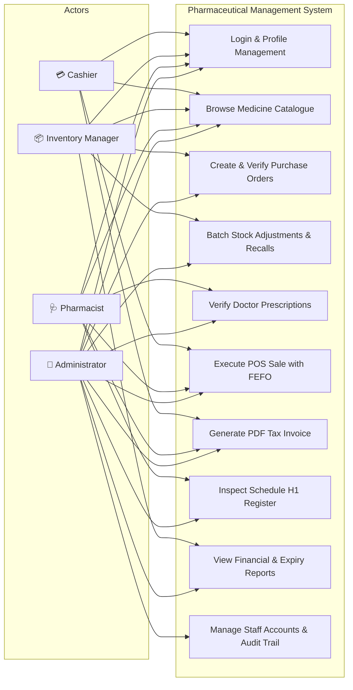
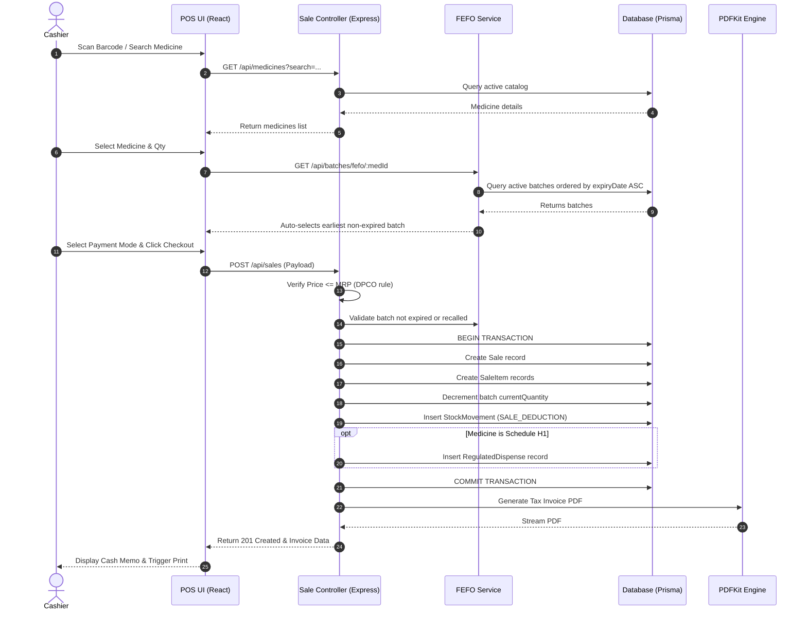

# UML Use Case & Sequence Diagrams
## Pharmaceutical Management System (PMS)

### 1. Use Case Diagram

```mermaid
flowchart LR
    subgraph Actors
        Admin["👑 Administrator"]
        Pharma["🩺 Pharmacist"]
        InvMgr["📦 Inventory Manager"]
        Cashier["💳 Cashier"]
    end

    subgraph System_PMS ["Pharmaceutical Management System"]
        UC1["Login & Profile Management"]
        UC2["Browse Medicine Catalogue"]
        UC3["Create & Verify Purchase Orders"]
        UC4["Batch Stock Adjustments & Recalls"]
        UC5["Verify Doctor Prescriptions"]
        UC6["Execute POS Sale with FEFO"]
        UC7["Generate PDF Tax Invoice"]
        UC8["Inspect Schedule H1 Register"]
        UC9["View Financial & Expiry Reports"]
        UC10["Manage Staff Accounts & Audit Trail"]
    end

    Admin --> UC1
    Admin --> UC2
    Admin --> UC3
    Admin --> UC4
    Admin --> UC5
    Admin --> UC6
    Admin --> UC7
    Admin --> UC8
    Admin --> UC9
    Admin --> UC10

    Pharma --> UC1
    Pharma --> UC2
    Pharma --> UC5
    Pharma --> UC6
    Pharma --> UC7
    Pharma --> UC8

    InvMgr --> UC1
    InvMgr --> UC2
    InvMgr --> UC3
    InvMgr --> UC4
    InvMgr --> UC9

    Cashier --> UC1
    Cashier --> UC2
    Cashier --> UC6
    Cashier --> UC7
```

---

### 2. POS Sale & Stock Deduction Sequence Diagram

```mermaid
sequenceDiagram
    autonumber
    actor Cashier
    participant UI as POS UI (React)
    participant API as Sale Controller (Express)
    participant FEFO as FEFO Service
    participant DB as Database (Prisma)
    participant PDF as PDFKit Engine

    Cashier->>UI: Scan Barcode / Search Medicine
    UI->>API: GET /api/medicines?search=...
    API->>DB: Query active catalog
    DB-->>API: Medicine details
    API-->>UI: Return medicines list

    Cashier->>UI: Select Medicine & Qty
    UI->>FEFO: GET /api/batches/fefo/:medId
    FEFO->>DB: Query active batches ordered by expiryDate ASC
    DB-->>FEFO: Returns batches
    FEFO-->>UI: Auto-selects earliest non-expired batch

    Cashier->>UI: Select Payment Mode & Click Checkout
    UI->>API: POST /api/sales (Payload)
    
    API->>API: Verify Price <= MRP (DPCO rule)
    API->>FEFO: Validate batch not expired or recalled
    
    API->>DB: BEGIN TRANSACTION
    API->>DB: Create Sale record
    API->>DB: Create SaleItem records
    API->>DB: Decrement batch currentQuantity
    API->>DB: Insert StockMovement (SALE_DEDUCTION)
    opt Medicine is Schedule H1
        API->>DB: Insert RegulatedDispense record
    end
    API->>DB: COMMIT TRANSACTION

    API->>PDF: Generate Tax Invoice PDF
    PDF-->>API: Stream PDF
    API-->>UI: Return 201 Created & Invoice Data
    UI-->>Cashier: Display Cash Memo & Trigger Print
```

